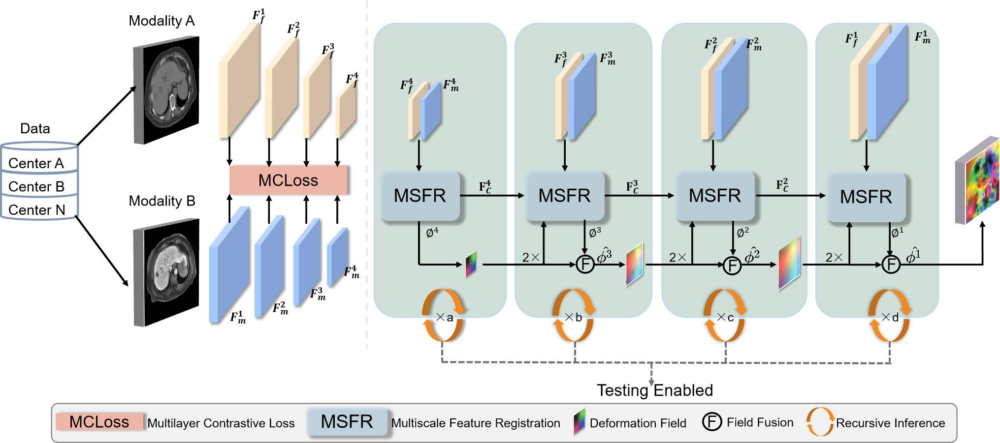
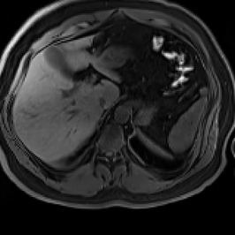

# ARDMR
This is the official  repository about "ARDMR: Adaptive Recursive Inference and Representation Disentanglement for Multimodal Large Deformation Registration"

## ToDo List
- [ ] Release training codes and ARIS strategy .
- [x] Release inference codes and pre-trained model. 

## Instructions
Please configure the environment before use. 
The repository currently contains inference/test code only, corresponding to the DMR results reported in the manuscript.
```shell
python test_mr2ct.py
```
When running the inference code, specify the path to the test data and ensure that the input data dimensions match those reported in the manuscript.



This GIF demonstrates how the moving image gradually deforms step by step to take on the structure of the stationary image.

## Acknowledgements
This project is developped on the codebase of [RDP](https://github.com/ZAX130/RDP) and [TM](https://github.com/junyuchen245/TransMorph_Transformer_for_Medical_Image_Registration). We appreciate their great work! 

